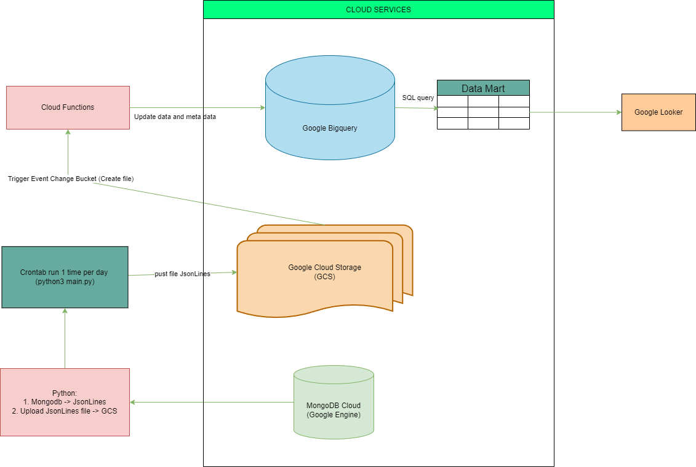
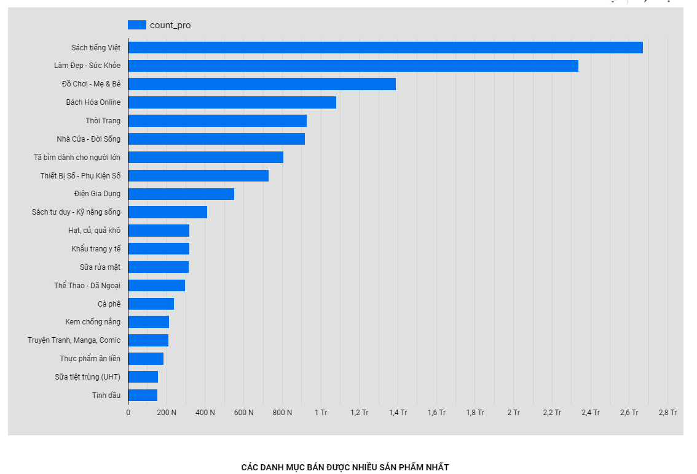
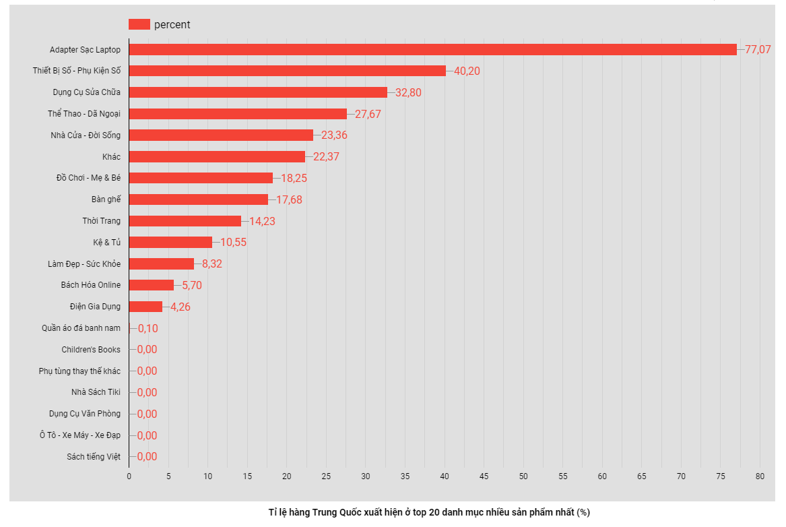
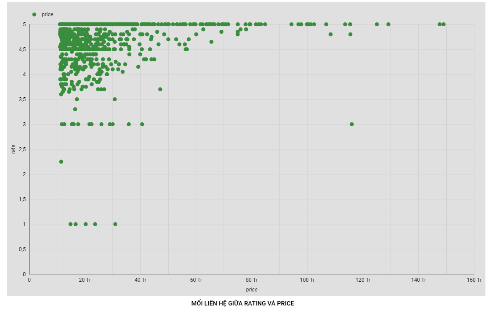
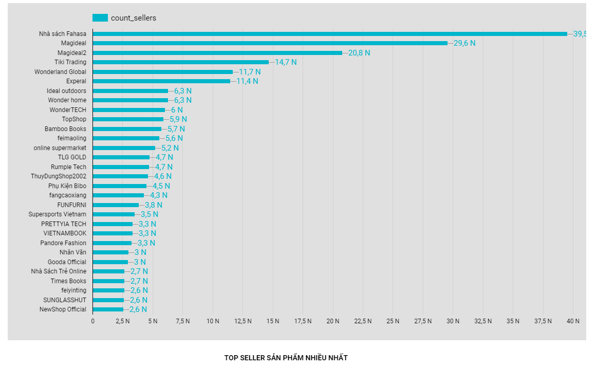

**NOTE**: 

Cause of security, I am not uploading the key.json file on the folder cloud function, you can take it from your cloud Google console

==================================================

**Project Description:**

* Automate update data from MongoDB -> Google Bigquery 1 time per day
* Handle with large data (about 30Gb with 1m5 records)

==================================================

PIPELINE INFRASTRUCTURE:

==================================================

Looker studio google (DATA MART): 

https://lookerstudio.google.com/u/0/reporting/18242aa8-2103-4176-be0d-c1ada84c9e50/page/X4OdD

